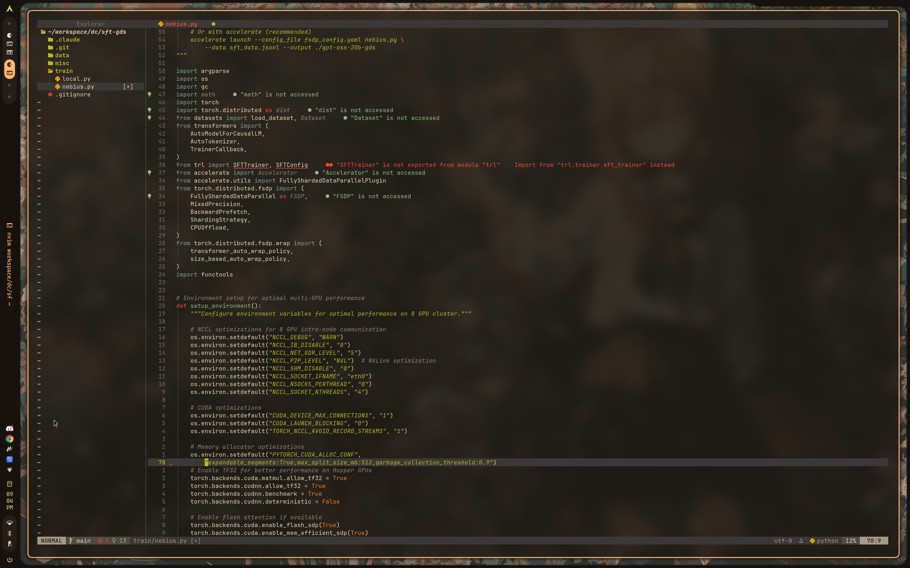

<p align="center">
  
</p>

<h1 align="center">nvim</h1>

<p align="center">
  <i>my neovim config. gruvbox, transparent, way too much rice.</i>
</p>

<p align="center">
  
  
  
</p>

---

### what's in here

```
lsp + completion      telescope + neo-tree      rust/go/ts/c++
lazygit + diffview    ai (avante/codecompanion) remote dev (distant)
google calendar       obsidian integration      discord presence
animations            smear cursor              a duck
```

---

### install

```sh
git clone git@github.com:vmfunc/nvim.git ~/.config/nvim
nvim
```

lazy.nvim bootstraps itself. just open nvim and wait.

---

### requirements

| required | optional |
|----------|----------|
| neovim 0.11+ | lazygit |
| nerd font | distant cli |
| ripgrep, fd | |

---

### keybinds

leader is `space`. press it and wait for which-key.

| key | action |
|-----|--------|
| `ctrl+p` | find files |
| `ctrl+b` | toggle tree |
| `ctrl+`` | terminal |
| `space g` | git |
| `space D` | remote dev |
| `space o` | obsidian |

full list in `lua/config/keymaps.lua`

---

### google calendar

optional. needs oauth credentials.

```sh
cp .env.example .env
# add your google cloud oauth credentials
```

see [google cloud console](https://console.cloud.google.com/) to create a project and enable calendar api.

---

### structure

```
lua/
├── config/          options, keymaps
├── plugins/         lazy.nvim specs
├── custom/          custom plugins (gcal)
└── neo-tree/        custom sources (distant)
```

---

<p align="center">
  <i>do whatever you want with it</i>
</p>
